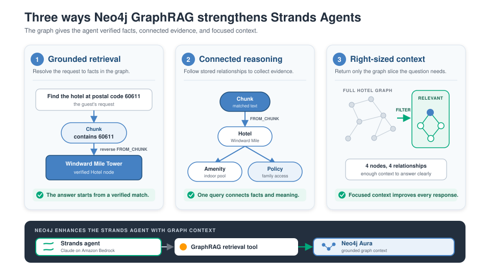

<style>
section {
  --marp-auto-scaling-code: false;
}

li {
  opacity: 1 !important;
  animation: none !important;
  visibility: visible !important;
}

/* Disable all fragment animations */
.marp-fragment {
  opacity: 1 !important;
  visibility: visible !important;
}

ul > li,
ol > li {
  opacity: 1 !important;
}
</style>

# The Grounded Booking Agent

Two read paths it can choose, and one write path it cannot reach

<!--
This deck has two hinges. "Two Read Tools, One Boundary" shows a normal Strands
agent routing by tool specification. "Writes Do Not Go Through the Model"
keeps the notebook's reservation command outside that agent.

Most agent talks cover the first half of this deck and stop. The reservation
half is where the workshop says something the room has probably not heard, so
protect the time for it. If you are running late, cut the ReAct slide, not the
write path.
-->

---

## What Is an Agent

A model with tools and a loop:

- **Perception:** it reads the question and the conversation so far
- **Reasoning:** it decides what it needs and which tool provides it
- **Action:** it calls the tool and gets a result back
- **Response:** it answers, or it loops again

The difference from a chatbot is the Action step. The model can reach your systems.

<!--
Say the last line as a warning, not a feature. Everything in this deck is about
what that reach is allowed to include.

A model that can call a search function is useful. A model that can call a
write function is a system where a wrong token becomes a row in a database.
"Writes Do Not Go Through the Model" is where that gets resolved.
-->

---

## The ReAct Loop

> Which Chicago hotel has both a spa and a swimming pool, what is its cancellation policy, and can I hold it for four guests?

1. **Reason:** the filter needs records; the policy needs source wording
2. **Act:** call `query_hotel_records`, then `search_hotel_passages`
3. **Observe:** one result carries rows and Cypher; the other carries passages and linked facts
4. **Reason:** the evidence identifies the hotel and its policy. The hold needs a separate command
5. **Respond:** I answer the first two clauses from context, and I say the third needs a reservation

Each turn of the loop is one round trip to the model.

<!--
Step 2 is the routing lesson. One user question can need both evidence shapes,
and the system prompt explicitly permits more than one tool call.

The structured tool adds another Bedrock call inside the tool to generate
Cypher. The returned Cypher is visible so the participant can inspect what ran.
-->

---

## Strands Agents in One Slide

```python
agent = Agent(
    model=BedrockModel(model_id=...),
    tools=list(READ_TOOLS),
    system_prompt=BASE_GROUNDING_PROMPT,
    hooks=[trace],
)
```

- **`Agent`** runs the loop and calls whichever tool the model selects
- **`BedrockModel`** connects it to Claude on Amazon Bedrock
- **`@tool`** builds a specification with a name, description, and input schema
- **The system prompt** states which facts the model may use and when it must abstain
- **`ToolTraceHook`** records the selected tool and its bounded result

Model-driven, not developer-scripted. You do not write "retrieve, then answer."

<!--
The notebook prints the final tool specifications before building the agent.
The docstring supplies most of the description, but the model receives the
generated specification, not the raw Python source.

Names and descriptions matter because the model must distinguish source wording
from counts, averages, rankings, filters, and relationship questions.
-->

---



<!--
Strands runs the agent loop. Amazon Bedrock provides the model. The retrieval
tool gives that agent verified facts and connected context from Neo4j.

Walk the three panels from left to right. Grounded retrieval resolves the
request to facts in the graph. Connected reasoning follows stored
relationships. Right-sized context returns only the small graph slice needed
for this question.

Neo4j complements Strands. It strengthens the context that the Strands agent
can use. The next slide shows the two read interfaces Module 3 exposes.
-->

---

## Two Read Tools, One Boundary

The model chooses the evidence shape that fits the question.

| Tool | Best fit | Evidence returned |
|---|---|---|
| **`search_hotel_passages`** | Amenities, rooms, policies, services, locations, source wording | Up to five passages and linked hotel facts |
| **`query_hotel_records`** | Counts, averages, rankings, filters, relationships | Generated read-only Cypher and bounded records |

Both take one natural-language `query`. Neither exposes credentials or a write.

<!--
The distinction is question shape, not implementation fashion. Passage search
preserves source wording. Structured queries let the database calculate across
the full matching set.

Routing remains a model decision. Clear, contrasting specifications make that
decision inspectable, and a fresh trace for every example keeps the evidence
from one case out of the next.
-->

---


<!--
Point first at the fork. The agent can use passage search, the structured record
query, or both. Both paths only read Neo4j.

Then point at the asymmetry. The model sits on the read lane only. The write
command is separate because it was never registered as a Module 3 tool.
-->

---

## Automatic Selection Is Observable

Module 3 uses a plain `BedrockModel`. Nothing forces a tool call.

- **Hotel facts:** the system prompt directs the model to use tool evidence first
- **No hotel fact:** greetings and thanks can receive a direct reply
- **Routing evidence:** the trace names every selected tool and records what came back
- **Variation:** the routing table reports a warning when the model chooses an unexpected path

A prompt states policy. The lab checks whether the observed turn followed it.

<!--
Do not call this enforcement. Automatic tool choice can vary, and the model can
produce a response without a tool if it does not follow the prompt.

The notebook makes that boundary explicit. Fresh agents isolate routing cases,
the trace records tool calls, and the availability check fails if no read tool
returned the expected structured verdict.
-->

---

## Two Evidence Shapes, One Verdict

| Read path | Tool-specific evidence |
|---|---|
| **Passages** | `passages`, `hotel_ids`, `top_result` |
| **Records** | `cypher`, `records`, `row_count` |

Both successful paths return `ok: true` and the same `grounding_result`:

`answerable`, `missing_fact`

Empty records are a successful read with zero rows. A query error is a separate error result.

The model receives bounded JSON evidence, never Neo4j credentials.

<!--
The passage path returns at most five passages, with at most 8,000 characters
of source text and 12 amenities in each matching record. The structured path
returns at most 25 list rows, while an aggregate can cover all matches.

The `cypher` field is there for inspection. A read-only query that executes can
still ask the wrong question, so successful execution is not proof of semantic
correctness.
-->

---

## A Grounded Answer

> "What amenities and guest rating does AnyCompany Cairo Nile View have?"

- **Full-text** matches the hotel name exactly
- **Vector** matches the meaning of "amenities and a rating"
- **The traversal** returns the connected amenity list and the exact `guest_rating` property

`search_hotel_passages` returns both fields beside the source text that matched.

<!--
This question is chosen to exercise both arms of the hybrid retriever at once,
which is why it is first in the notebook.

Point at guest_rating specifically. It is an exact graph property, written as a
float during Module 1's extraction because the schema told it to. It is not a
number the model read out of a sentence.
-->

---

## Abstention

> "Does AnyCompany Cairo Nile View guarantee room availability next weekend?"

Either read path can return real hotel evidence. Neither has live inventory.

- **The graph holds** descriptive facts and policies, not live room inventory
- **"Subject to availability"** is a policy sentence, not proof that a room is open
- **The tool verdict** returns `answerable: false` and `missing_fact: live_room_availability`
- **The notebook check** verifies that a tool ran and returned that verdict

The check reads structured evidence, not a required phrase in the final answer.

<!--
This slide tests the observable grounding contract rather than one exact model
sentence, and it is the one that gets the most comment in the room.

The subtlety is that the retriever did its job. It found relevant text. The
failure mode being prevented is the model reading "subject to availability" and
producing a confident sentence about next weekend, which is exactly the kind of
plausible answer deck 1 opened with.

The check detects a bad turn during the lab. It does not prevent every possible
bad response in a deployed agent. Run this one live if you run anything live.
-->

---

## Writes Do Not Go Through the Model

The reservation command sits beside the agent, not inside it.

- **Not a tool.** It is plain Python the application calls
- **Five defined inputs.** The command accepts `request_id`, `hotel_id`, `check_in`, `check_out`, and `guests`
- **`hotel_id`** is the stable identifier retrieval already returned
- **Application-owned Cypher.** The model writes none of it

Retrieval and writes need different controls, so they get different code paths.

<!--
Second hinge, and the part of this deck that is least common elsewhere.

The usual design registers create_reservation as a tool and constrains it with
a careful prompt and a JSON schema. That works until the model passes a
plausible wrong value, and then you have a row.

Here the model's role ends at proposing. It can tell the user which hotel to
book and why. Turning that into a request is the application's call, and the
inputs are typed before anything opens a transaction.
-->

---

## The Rule Is Enforced Inside the Transaction

Neo4j stores a maximum-guests rule. A 15-guest request comes back:

```json
{
  "status": "rejected",
  "reason_code": "max_guests_exceeded",
  "max_guests": 10
}
```

- **One transaction** checks for an existing `request_id`, reads the enabled rule, verifies the hotel, and creates the node
- **The rejection returns before the create query runs.** No `ReservationRequest` node exists
- **No interleaving.** No other request can change the rule between the check and the write

<!--
Two things make this different from validating in Python.

The rule lives in the graph, so changing it does not require a deploy, and the
same rule is visible to anything else reading that graph.

The check and the write are in one transaction, so there is no window where
another request changes the relevant state between them. Validate first and
write second in separate calls and that window exists, however small.

reason_code is a machine-readable field on purpose. A caller can branch on it.
A human-readable message alone cannot be branched on reliably.
-->

---

## Retries Are Idempotent

The caller supplies `request_id`, and it stays the same across retries.

- **First call:** the command creates the `ReservationRequest` and links it with `FOR_HOTEL`
- **Second call, same id:** the command finds that node and returns `duplicate: true` with the original `created_at`
- **Two concurrent retries:** a uniqueness constraint lets Neo4j accept one and roll back the other

The command then reads the accepted node and returns it as the duplicate result.

<!--
Idempotency is what makes retrying safe, and retrying is what every network
client does. Without this, a timeout on a successful write produces two
reservations.

The concurrency case is the one worth naming. Application-level "check then
create" has a race. The uniqueness constraint closes it in the database, which
is the only layer that can.
-->

---

<style scoped>
/* Five rows of two-column prose plus framing. */
section { font-size: 22px; }
</style>

## Who Enforces What

| Layer | What it owns |
|---|---|
| **The model** | Chooses read tools and writes the final response under prompt policy |
| **Tool specifications** | Describe the routing boundary and one-field input schema |
| **Read tools** | Validate input and return bounded evidence plus a verdict |
| **Query guard** | Plans generated Cypher and allows only read plans |
| **The command** | Validates the five inputs and opens the transaction |
| **Neo4j** | Holds the maximum-guests rule and rejects a duplicate `request_id` |

The model decides. Code and the database enforce the hard boundaries.

<!--
This corrects an important distinction. The prompt governs the model's intended
answer behavior, but input validation, the read-only planning guard, and the
transaction are mechanisms in code or Neo4j.

The model still cannot commit a reservation in Module 3. Its role ends with the
read response; the application calls the reservation command separately.
-->

---

## Correct and Safe, and Running on Your Laptop

The agent chooses between two read paths, exposes its evidence, and cannot write to the graph.

Everything is still local: the agent, both read tools, their drivers, the trace, and the command.

- **Module 4** moves the tools out, behind an AgentCore Gateway
- **Module 5** moves the whole agent out, onto AgentCore Runtime

The core boundaries persist even where later modules package the tools differently.

<!--
Synthesis, not restatement. The point is that the interesting work is done, and
the next two modules are deployments of it.

Say the last line carefully. Module 4 publishes the two retrieval capabilities
under Gateway tool names. Module 5 is a deployment-oriented variant with a
read tool and a reservation tool. The exact tool sets differ, while read
evidence, guarded writes, and explicit results remain the throughline.
-->
