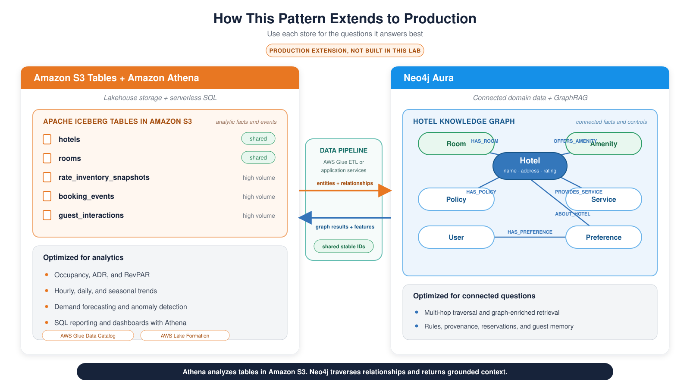

<style>
section {
  --marp-auto-scaling-code: false;
}

li {
  opacity: 1 !important;
  animation: none !important;
  visibility: visible !important;
}

/* Disable all fragment animations */
.marp-fragment {
  opacity: 1 !important;
  visibility: visible !important;
}

ul > li,
ol > li {
  opacity: 1 !important;
}
</style>

# The Hotel Booking Assistant

The dataset, the environment, and who owns which control

<!--
This deck runs immediately before Setup, and its job is to make the room
confident about what they are about to build and what they own.

The shape is one roadmap slide, then the data and the one modeling choice that
makes the data worth having, then the request flow, then the control-ownership
table. That last slide is the workshop's actual argument, stated once, early,
so the later modules can point back at it.

Everything before the control table is orientation. Do not spend the deck
there.
-->

---

<style scoped>
/* A numbered list of six plus two closing lines. */
section { font-size: 24px; }
</style>

## What You Will Build

Six modules, six verbs:

1. **Build** a knowledge graph from hotel documents into your own Aura instance
2. **Compare** eight retrieval patterns and identify complementary question shapes
3. **Ground** an agent in two bounded read tools, and keep its write path separate
4. **Publish** the retrieval tools through AgentCore Gateway, on the Model Context Protocol
5. **Deploy** the whole agent to AgentCore Runtime as a container
6. **Remember** guest preferences in the same graph, with provenance

Modules 3, 4, and 5 reuse the same boundaries while packaging their tools differently.

To start you need an Aura instance, an AWS account with Bedrock access in **us-east-1**, a filled-in `CONFIG.txt`, and a passing `environment/verify.py`. Setup has the steps.

<!--
Deck 1's thesis, restated: the model does not get smarter across these six
steps. What changes is what it can see and what it is allowed to do.

Say the grouping out loud, because it saves questions later. Modules 1 and 2
are where the day's understanding gets built. Modules 3, 4, and 5 are the same
design deployed three ways, so nobody should spend Module 5 wondering why the
Gateway disappeared. If you fall behind, 4 and 5 are the ones to demonstrate
rather than have everyone run.

Do not read the setup line out. It is on the screen so people know what is
coming, and the setup pages have the actual steps. Two things are worth saying
about it anyway.

First, everyone gets their own database. Resist the temptation to hand out a
shared one. When everyone reads the same graph, one person's mistake is
invisible to them and every later module appears to work.

Second, verify.py runs eight checks before Module 1: Python version, imports,
settings, AWS credentials, the hero hotel in the graph, and each of the three
Bedrock models. Tell the room to read the first failure rather than the last.
-->

---

<style scoped>
/* Four rows of two-column prose sit just under the theme's 29px. */
section { font-size: 26px; }
</style>

## Neo4j and AWS: What Each Platform Brings

| Component | Role in this workshop |
|---|---|
| **Neo4j Aura** | Stores connected hotel facts, source text, indexes, business rules, reservation requests, and memory |
| **Amazon Bedrock** | Provides Claude for extraction and reasoning, Amazon Nova for retrieval embeddings, Titan Text Embeddings V2 for memory |
| **Strands Agents** | Gives the model its tools and runs the agent loop |
| **AgentCore** | Exposes remote tools through Gateway and runs the deployed agent on Runtime |

The graph holds more than the retrieval corpus. Business rules and reservation requests live there too, and that is what makes the write path in Module 3 enforceable.

<!--
Give the two platforms parallel treatment. Neo4j holds connected facts and
rules. Bedrock provides reasoning and embeddings. Each platform owns a clear
part of the request path.

The closing line is the one that is worth slowing down for. Most agents keep
their business rules in a system prompt, where the rule and the reasoning share
one surface and the model can talk itself past either. Here a rule is data in
the same database as the booking, so Module 3 can check it inside the
transaction that writes.

The two agent layers arrive as the day goes on. The graph and the models are in
every module.
-->

---

<style scoped>
/* Seven rows of examples plus two closing paragraphs. */
section { font-size: 23px; }
</style>

## The Hotel Dataset

A fictional chain of AnyCompany hotels, one FAQ document per property.

| Node | Holds | Example |
|---|---|---|
| `Hotel` | `name`, `address`, `guest_rating`, `total_rooms` | AnyCompany Cairo Nile View |
| `Room` | `type`, `bed_configuration`, `max_occupancy`, rate range | Suite, one king bed |
| `Amenity` | `name`, unique across the graph | Full-Service Spa |
| `Policy` | `name`, `description` | 24-hour cancellation |
| `Service` | `name`, `cost`, `hours`, availability | Airport transfer |
| `Document` | `source_filename` | The FAQ file |
| `Chunk` | `text`, `embedding` | The searchable passage |

Hundreds of properties worldwide. These eight carry the workshop: Cairo, Chicago, Paris, Tokyo, Sydney, Rio de Janeiro, Cape Town, Prague.

You restore this from a prebuilt dump, and the dump deliberately ships with no vector index, no full-text index, and five hotels missing. Module 1 is where all three arrive.

<!--
The last line is the setup for Module 1. Participants often assume a prebuilt
graph means there is nothing to build. There is: the two indexes that every
later retrieval depends on, and five held-out documents to extract.

Cairo is deliberately not one of the five. Module 2's comparison has to work
identically for everyone, so it cannot depend on a participant's own extraction
run. The hero hotel, AnyCompany Cairo Nile View, also appears in the
environment check, in Module 3's grounded answer, and in the Module 5 smoke
tests. If someone sees it three times and asks, that is why.

Read the Amenity row out and stop there. The next slide is why it is written
that way.
-->

---

<style scoped>
/* One graph pattern plus four modeling points. */
section { font-size: 25px; }
</style>

## Shared Amenity Nodes Connect Hotels

`Full-Service Spa` is one shared `Amenity` node. Every hotel that offers it connects through `OFFERS_AMENITY`.

```cypher
MATCH (a:Amenity {name: "Full-Service Spa"})
      <-[:OFFERS_AMENITY]-(h:Hotel)
RETURN a.name, collect(h.name) AS hotels
```

- **One shared entity:** `MERGE` creates one node for the normalized amenity name
- **Two-way traversal:** start at a hotel to list amenities, or start at an amenity to find hotels
- **Connected context:** continue from each hotel to rooms, policies, services, chunks, and documents
- **Composable paths:** Module 2 starts from a search match and walks outward through these relationships

The graph stores the amenity once and makes every connected path available for traversal.

<!--
- Read the pattern from right to left. Each Hotel points to the same Amenity.
- Module 1 normalizes amenity names before writing them.
- MERGE uses the normalized name to create one shared node.
- A traversal can start at the Hotel or the Amenity.
- From the matched Hotel, the query can continue to policies, rooms, services,
  chunks, and source documents.
- Module 2 uses this outward traversal to assemble connected context.
-->

---



<!--
This is a production extension. Participants build the Neo4j and agent path in
this lab. The lakehouse shows how the pattern can grow.

Amazon S3 Tables stores high-volume analytic facts and events as Apache
Iceberg tables. Amazon Athena queries those tables with serverless SQL. The
AWS Glue Data Catalog holds the shared table metadata. Lake Formation can
govern access.

Neo4j Aura stores the connected hotel domain, GraphRAG paths, rules,
provenance, reservations, and guest memory. Stable identifiers connect both
views through an ETL pipeline or application services.

The split follows the workload. Athena scans and aggregates tables. Neo4j
traverses relationships and returns focused context. The next slide returns
to the exact request path that participants build today.
-->

---


<!--
Walk this end to end, once, slowly. It is the only time today the whole path
is on one slide.

A question arrives at the Strands agent running a model on Bedrock. The model
reads two tool specifications. It can choose passage search, which uses Nova,
the vector and full-text indexes, and a reviewed traversal, or a structured
record query, which adds a model call to generate Cypher and an `EXPLAIN`
read-plan check. Bounded evidence and a shared verdict come back to the model.

The reservation write is not on this path at all. It runs beside the agent,
and the next slide is where you say who owns it.

The packaging changes across later modules. Module 3's key lesson is the
model-driven choice between two local read tools.
-->

---

<style scoped>
/* Six rows of three-column prose. */
section { font-size: 21px; }
</style>

## The Model Chooses Inside Guarded Boundaries

| Decision or constraint | Owner |
|---|---|
| Which read tool fits the question | The model, from two tool specifications |
| Passage-search configuration and traversal | Application code, fixed inside `search_hotel_passages` |
| Whether generated Cypher has a read plan | The `EXPLAIN` guard, backed by a read-only database identity in production |
| Whether live availability is supported | The shared tool verdict, computed from the question and graph boundary |
| Rejecting an invalid or duplicate write | Neo4j, inside the reservation transaction |
| Who can call AWS services | IAM, on the execution role |

The model routes and writes prose. Code and the database own the hard constraints.

<!--
This is the control-ownership correction to emphasize. Module 3 deliberately
returns one decision to the model: which evidence shape fits the question.

The passage tool still owns a fixed retrieval configuration. The structured
tool does allow a model to generate Cypher, but the query is returned for
inspection and Neo4j runs it only after the planner reports a read plan. A
valid read query can still have the wrong meaning. The plan check is a safety
boundary. Semantic validation remains a separate responsibility.

The availability verdict is deterministic data from the tool. The final prose
and whether the agent follows its prompt remain model behavior, which the lab
observes through traces rather than claiming to enforce.

This table reuses cleanly with a different schema and a different domain, which
is the takeaway to name out loud.

Head to Setup. Every path ends in the same place: a terminal, four Neo4j
settings in CONFIG.txt, AWS credentials in us-east-1, and eight passing checks.
-->
