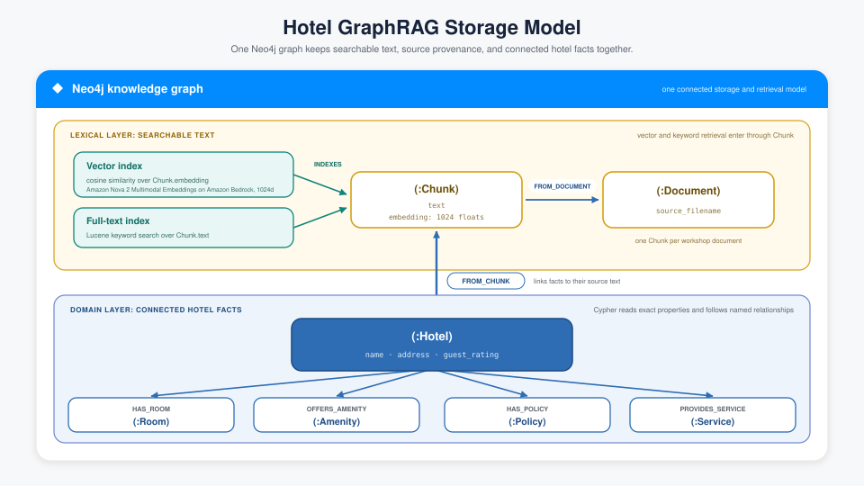
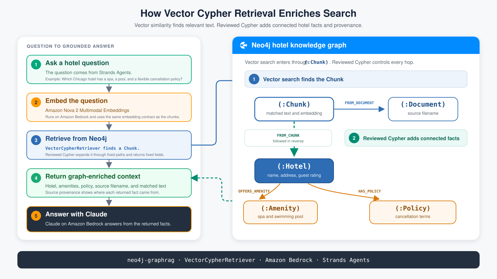

<style>
section {
  --marp-auto-scaling-code: false;
}

li {
  opacity: 1 !important;
  animation: none !important;
  visibility: visible !important;
}

/* Disable all fragment animations */
.marp-fragment {
  opacity: 1 !important;
  visibility: visible !important;
}

ul > li,
ol > li {
  opacity: 1 !important;
}
</style>

# GraphRAG Retrieval

Eight ways to search the graph, and how to choose one

> Which Chicago hotel has both a spa and a swimming pool, what is its cancellation policy, and can I hold it for four guests?

This deck answers the first two clauses. Module 3 answers the third.

<!--
The longest deck of the day, and the one the whole workshop turns on. Its hinge
is "How Graph-Enriched Retrieval Works." Everything before it builds
the case that similarity alone is not enough. Everything after it is a tour of
the eight patterns and a decision framework.

Put the hero question on the screen and leave it there for a beat. Deck 1
promised it decomposes into three mechanisms, and this deck delivers two of
them: the Cypher template for the spa and the pool, hybrid retrieval plus
traversal for the policy.

The pacing trap is spending too long on embeddings. The room mostly knows what
an embedding is. Get to "Where Vector Search Stops," where vector search fails
on this corpus, and
spend your time there.

This deck owns retrieval vocabulary for the whole workshop. Later decks assume
the room has seen these class names.
-->

---

## Embeddings

The model contributes language. Your data contributes facts. Retrieval is what puts your facts in front of it, and it starts here.

A model turns text into a list of numbers that positions it in meaning space.

- **1024 numbers per chunk** in this workshop, from Amazon Nova
- **Similar meaning, nearby vectors.** "Standard arrival processing" lands near "check-in time"
- **Cosine similarity** measures how closely two vectors point the same way. Neo4j reports it from 0 to 1
- **Same model, same dimensions, same purpose** for documents and for questions

A mismatched embedder returns wrong rows while reporting success.

<!--
RAG is three boxes. Retrieve source text from your data, augment the prompt
with it, generate an answer from what you gave the model. Most of the room has
built one, so name the boxes and move. Everything interesting is in the first
one, and this deck is about that box.

RAG does not make the model know your business. It puts your business in front
of the model for the length of one call.

The last line of the slide is the one to dwell on. Nothing errors. The index accepts the
query, returns the requested number of results, and reports scores. They are
just comparisons between vectors from two different spaces.

Both the build path and the query path in this workshop import their embedder
settings from workshop/retrieval_contract.py for exactly this reason.
-->

---

## Chunking

How much text goes into one searchable unit is a real trade-off:

- **Larger chunks** keep related facts together, and return more irrelevant text per hit
- **Smaller chunks** retrieve precisely, and split a fact away from its context

This corpus uses one chunk per document. The splitter is set to 12000 characters and the largest document is 7,442 bytes.

`hybrid_retrieval.py` then caps returned chunk text at 8,000 characters.

<!--
The cap keeps each returned passage bounded while preserving this corpus's full
hotel documents. It was raised from 1,200 because that shorter limit cut the
cancellation policy mid-word and made a grounded quotation impossible.

A production design can decouple these completely: large chunks for extraction,
smaller chunks for retrieval, two different chunk sets over the same documents.
Say that, because someone always asks.
-->

---

## Vector Search

Three steps, every time:

1. **Embed the question** with the same model that embedded the chunks
2. **Query `hotel_chunk_embeddings`** for the nearest vectors by cosine similarity
3. **Return `top_k` chunks** with their scores

Reading the scores: relative ordering is meaningful, absolute values are not.

`top_k=3` for a focused question, `top_k=5` when several documents may be relevant.

<!--
The scores line saves an argument. Attendees ask what score counts as a good
match, and there is no fixed threshold. A 0.62 top hit in one corpus is
excellent and in another is noise. What you can trust is that the first result
scored higher than the second.

Vector search works well on the workshop's first question. "When does standard
arrival processing begin" finds the Cairo chunk whose text says "standard
check-in time," and the answer 3:00 PM comes back. Different words, same
meaning, exactly what embeddings are for.
-->

---

<style scoped>
/* Three rows of two-column prose plus framing. */
section { font-size: 25px; }
</style>

## Where Vector Search Stops

| Question | Why similarity fails |
|---|---|
| "Cancellation policy for the hotel at `60611`" | A five-digit token carries almost no meaning. Its embedding lands near every other number, and the Chicago chunk ranks far down |
| "Chicago hotels with both a spa and a pool" | Similarity ranks passages. Nothing ties two conditions to the same `Hotel` node |
| "Which other hotels have this amenity" | There is no single passage to find. The answer is a pattern across documents |

Three different failures. They need three different fixes.

<!--
This is where the deck earns the room's attention. The notebook runs a top_k=30
diagnostic scan on the postal-code question and prints where the Chicago chunk
actually ranked. Show it live.

Be precise about the three fixes, because they map onto the rest of the deck:
the postal code needs full-text, the spa-and-pool AND needs a Cypher template,
and the shared amenity needs a traversal. None of them is fixed by a better
embedding model.
-->

---

## Context Rot

More context has a cost.

- **Long inputs degrade accuracy**, even on tasks the model handles easily at short length
- **Chroma Research** measured this across models and called it context rot
- **Retrieving more chunks** raises recall. It also lowers the odds the model uses the right one

Returning the ten facts an answer needs beats returning ten documents that contain them.

<!--
This slide is the quiet argument for the graph, and it lands better here than
as a benefits bullet.

The instinct when retrieval misses is to raise top_k. That trades one failure
for another: the right chunk is now in the context, buried among nine
distractors, and the model has to find it.

Graph enrichment attacks the same problem from the other side. Instead of more
passages, it returns structured fields, hotel name, rating, amenity list,
source filename, which cost a fraction of the tokens and say exactly what they
are.
-->

---



<!--
Start with storage. One Neo4j graph keeps the searchable text, its source, and
the connected hotel facts together.

The lexical layer holds the Chunk, its embedding, and both indexes. The domain
layer holds the Hotel and the facts connected to it. Each workshop document
has one Chunk.

Search enters at Chunk. The traversal follows FROM_CHUNK in reverse to Hotel,
then follows named relationships to Room, Amenity, Policy, and Service.

The next slide shows that read path as a request flow.
-->

---



<!--
Follow the numbered path on the left. The question is embedded with the same
Amazon Nova model used for the stored chunks. Vector search finds a Chunk.
Reviewed Cypher then expands from that Chunk to the Hotel, Amenity, Policy, and
source Document.

The two numbered bands on the graph are the distinction to protect. Vector
search decides where the query lands. The reviewed Cypher query decides which
connected facts come back.

This slide shows VectorCypherRetriever, pattern 2 in the comparison. The final
application uses the same enrichment idea with hybrid search in pattern 6.
-->

---


<!--
The decision guide. Do not read it aloud.

Use it to orient: the left side is how you find the chunk, the right side is
what happens after. The two structured patterns at the bottom skip the chunk
entirely and query the domain graph directly.

Come back to this slide at the end of the deck, after the room has seen all
eight.
-->

---

## 1. Vector Retriever

`VectorRetriever` returns the matched chunks and nothing else.

- **Good for:** A question phrased differently from the source text still finds its chunk
- **Returns:** The result carries ranked chunk text and a similarity score
- **Not for:** A question that needs a hotel property, an amenity list, or a `hotel_id` gets none of them back

The baseline. Everything after this adds to it.

<!--
Worth running once in the notebook so the room sees the shape of a bare result:
text and a number.

The specific gap to name is hotel_id. It exists as a property on the Hotel node
and it is nowhere in the chunk text, so no amount of vector tuning returns it.
That is the next slide.
-->

---

## 2. Vector Cypher Retriever

Vector search finds the chunk. A reviewed `retrieval_query` runs from every match.

- **The chunk is the anchor, not the answer**
- **Neo4j calls this pattern** Graph-Enhanced Vector Search
- **Returns:** One record carries chunk text, hotel properties, the amenity list, and the source filename

Master this one. The other three retrievers that enter through an index are variations on it.

<!--
This is the retriever to spend real time on, because understanding it makes the
remaining three free.

The comparison in the notebook tests five requested fields. VectorRetriever
names one of them, the source filename, and only because a second lookup query
goes and gets it. VectorCypherRetriever names all five, because it follows
FROM_CHUNK to the Hotel node where those properties actually live.
-->

---

<style scoped>
/* A code block plus four bullets. */
section { font-size: 24px; }
</style>

## Writing a retrieval_query

```cypher
MATCH (node)-[:FROM_DOCUMENT]->(document:Document)
OPTIONAL MATCH (hotel:Hotel)-[:FROM_CHUNK]->(node)
CALL (hotel) {
    MATCH (hotel)-[:OFFERS_AMENITY]->(amenity:Amenity)
    WITH DISTINCT amenity.name AS amenity_name ORDER BY amenity_name LIMIT 12
    RETURN collect(amenity_name) AS amenities
}
RETURN hotel.name AS hotel_name, document.source_filename AS source_filename, ...
```

- **`node` and `score` are already in scope.** The retriever puts them there
- **`OPTIONAL MATCH`, never `MATCH`,** so a strong chunk survives failed extraction
- **Collect one-to-many inside a subquery,** or you get one row per amenity
- **`field_provenance`** maps each returned field back to the graph path that produced it

<!--
Four rules, and each one is a bug someone has shipped.

OPTIONAL MATCH first. Use plain MATCH and a chunk whose hotel extraction failed
vanishes from the results entirely. The Module 2 notebook query keeps it and
reports graph_enrichment_status as "missing Hotel enrichment for semantic hit,"
which is a diagnosable result instead of a silent hole.

The block on this slide is that notebook traversal with the application's
amenity subquery dropped into it. Neither file holds it verbatim, so send
anyone who wants to copy one to workshop/hybrid_retrieval.py.

The subquery is the one that surprises people. Match amenities in the top-level
pattern and a hotel with twelve amenities returns twelve rows, top_k is spent
on one hotel, and the other matches never make it back.

field_provenance is unusual and worth pointing at. Every returned field carries
the graph path it came from, so a reviewer looking at a suspicious value can go
straight to the traversal that produced it.
-->

---

## 3 and 4. Full-Text Search

The `60611` fix. Apache Lucene over `Chunk.text`.

```cypher
CALL db.index.fulltext.queryNodes('hotel_chunk_fulltext', '60611', {limit: 5})
YIELD node, score
```

- **Exact terms:** `60611` matches the literal token
- **Fuzzy terms:** A misspelled `Winward~` still matches the correctly spelled `Windward`
- **Boolean terms:** `spa AND pool` requires both, in the same chunk

Rare tokens score high, which is the opposite of how embeddings treat them. Continue the same procedure into the traversal from pattern 2 and you have pattern 4, exact-term entry with a graph-enriched exit.

<!--
Say plainly that the graph is not the hero of this slide. A full-text index is
a forty-year-old idea and it beats a modern embedding model outright on this
question. Admitting that is what buys credibility for the slides where the
graph genuinely is the answer.

Note the limit of the boolean form. "spa AND pool" requires both terms in the
same chunk, which is not the same as requiring both amenities on the same
hotel. "Cypher Templates" has the real fix.

This runs through a Cypher procedure. There is no FulltextRetriever class in
the workshop's neo4j-graphrag version, and there is no class for pattern 4
either. An application writes that one as a reviewed parameterized query or a
small custom retriever. Say so before anyone hunts for a class name.

Pattern 4 is where the structure should click. The entry search and the
traversal are independent choices, and any of the three searches can feed the
same enrichment.
-->

---

## 5. Hybrid Search

Vector and full-text fail in opposite directions. Hybrid runs both arms and fuses the results.

- **Vector** handles paraphrases and blurs literal identifiers
- **Full-text** preserves identifiers and cannot match different wording
- **`HybridRetriever`** queries both indexes and merges the ranked lists

Each arm can get different input. The notebook sends `60611` to the full-text arm and the full question's vector to the other.

<!--
That last detail is a practical trick worth calling out. query_text goes to
Lucene and query_vector goes to the vector index, and they do not have to
describe the same thing.

Sending only the postal code to the full-text arm keeps the match focused
instead of diluting it with the surrounding question words. Reusing the vector
already computed for the full question avoids a second Bedrock call.
-->

---

## Hybrid Re-ranking

Cosine scores and Lucene scores are on different scales. The library normalizes both first, dividing every score by the best score from its own index.

- **`NAIVE`:** The ranker takes the larger normalized score per chunk. This is the library default
- **`LINEAR`:** The ranker computes `alpha * vector + (1 - alpha) * fulltext`
- **`alpha`:** This is the vector weight, from 0 to 1. The full-text weight is `1 - alpha`

The notebook uses `ranker='linear'` with `alpha=0.2` for the postal-code question.

<!--
Walk the alpha choice out loud. 0.2 gives the full-text arm eighty percent of
the weight, because 60611 identifies the hotel far more precisely than any
prose around it. With that setting the result comes back as Windward Mile Tower
and its 24-hour cancellation policy.

The normalization step is why alpha is interpretable at all. Without it you
would be adding a 0.7 cosine score to a Lucene score of 14 and the vector arm
would never matter.
-->

---

## 6. Hybrid Cypher Retriever

Both arms, fused, then the reviewed traversal.

```python
hybrid_cypher_retriever = HybridCypherRetriever(
    driver=driver,
    vector_index_name='hotel_chunk_embeddings',
    fulltext_index_name='hotel_chunk_fulltext',
    retrieval_query=RETRIEVAL_QUERY,
    embedder=embedder,
)
```

| Entry search | Return the chunk | Run the traversal |
|---|---|---|
| Vector | `VectorRetriever` | `VectorCypherRetriever` |
| Vector plus full-text | `HybridRetriever` | `HybridCypherRetriever` |

<!--
Walk the grid one cell at a time. Rows are the entry search,
vector or vector-plus-full-text. Columns are what happens next, return the
chunk or run the traversal. Four classes, four cells.

This is the passage path the booking application uses. The structured path uses
Text2Cypher, and the closing slide explains why Module 3 exposes both.
-->

---

## 7. Cypher Templates

Cypher Templates run a reviewed query for a known question shape.

They read the graph directly. They use exact conditions instead of ranking similar text.

```cypher
WITH *, any(name IN amenities WHERE toLower(name) CONTAINS 'spa') AS has_spa,
        any(name IN amenities WHERE toLower(name) CONTAINS 'pool') AS has_pool
RETURN hotel_name, source_filename, amenities, has_spa AND has_pool AS qualifies
```

- **Candidates:** both Chicago hotels the query considered
- **Qualifiers:** Lakeview Horizon Suites, which has both
- **Exclusions:** Windward Mile Tower, with the missing amenities named

The query guarantees that both amenities belong to the same hotel.

<!--
Similarity search ranks text by meaning. It does not prove that two conditions
are true for the same hotel. This template checks both conditions directly in
the graph.

The query returns candidates, qualifiers, and exclusions. These groups show
which hotels were checked and why each hotel passed or failed.
-->

---

## 8. Text2Cypher

The model writes the query from the schema at request time.

- **Prompt carries** the extraction schema and three worked examples
- **`EXPLAIN`** plans the statement before it runs
- **Only `query_type == 'r'` executes**, with a statement timeout
- **A read-only database user in production** rejects writes even if the earlier checks miss one

Flexible, and the only pattern where an unreviewed query reaches the database.

<!--
Three layers, and they are deliberately redundant. The prompt asks for
read-only Cypher, the application verifies it with EXPLAIN, and the database
user cannot write regardless.

There is a quieter failure mode than a malicious query. The schema names the
relationship OFFERS_AMENITY. A model that guesses HAS_AMENITY produces valid
Cypher that returns zero rows, and zero rows looks like "no such hotel" rather
than "wrong query." Supplying the schema and examples is what reduces that.

Deck 7 puts this behind an AgentCore Gateway with the same EXPLAIN guard, so
flag the forward pointer.
-->

---

## One Search Interface, Different Retrievers

Each index-backed retriever uses the same `search()` call. Each call returns items in the same format.

- **`content`:** the text sent to the model as context
- **`metadata`:** structured hotel fields. The application reads a hotel ID as `metadata['hotel_id']`
- **`result_formatter`:** the code that converts a Neo4j record into `content` and `metadata`

Only the retriever setup changes. The question and result handling stay the same.

<!--
Module 2 sends the same questions to several retrievers. The shared input and
output format makes the results easy to compare.

The application can change the retriever constructor while keeping the model,
question, and result-processing code unchanged.
-->

---

<style scoped>
/* Six rows plus a closing question list. */
section { font-size: 23px; }
</style>

## Choosing the Right Retriever

| If the question | Use |
|---|---|
| Is a paraphrase of the source text | `VectorRetriever` |
| Contains an exact identifier or name | Full-text, or hybrid with a low `alpha` |
| Needs hotel properties or provenance | Any Cypher variant |
| Mixes paraphrase and exact terms | `HybridCypherRetriever` |
| Has a fixed, known shape with conditions | Cypher Templates |
| Is structured but unpredictable | `Text2CypherRetriever`, guarded |

Three questions to ask: is the entry term literal or fuzzy, does the answer need connected facts, and is the question shape known in advance.

<!--
The three questions at the bottom are the takeaway, more than the table. They
transfer to any corpus. The table only applies to this one.

Note that the rows are not exclusive. Module 3 exposes two complementary paths:
Hybrid Cypher for source text and linked facts, and guarded Text2Cypher for
structured questions across many records.
-->

---

<style scoped>
/* Four rows of two-column prose plus framing. */
section { font-size: 25px; }
</style>

## What Module 3 Uses, and Who Decides

The booking agent exposes two bounded read tools with different evidence shapes.

| Tool | Implementation | Best fit |
|---|---|---|
| **`search_hotel_passages`** | Fixed `HybridCypherRetriever`, `top_k=5`, reviewed traversal | Source wording and linked hotel facts |
| **`query_hotel_records`** | `Text2CypherRetriever`, generated query planned with `EXPLAIN` | Counts, averages, rankings, filters, relationships |

Module 2 lets you call each pattern directly. Module 3 lets the model choose by reading the two tool specifications.

<!--
This is the handoff to Module 3. The application fixes the implementation and
input contract of each path; the model chooses between those paths.

search_hotel_passages accepts query text and nothing else. Not an index name,
not a top_k, not a ranker. The model cannot widen its own search, and that is a
deliberate constraint rather than a missing feature.

Hybrid Cypher fits hotel text because questions mix paraphrased language and
exact names. Text2Cypher fits aggregates and flexible filters because five top
passages cannot represent every matching record.

Next: Module 3 puts both read paths behind one agent and traces its choice.
-->
